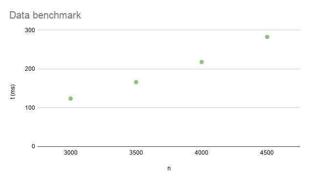

## 📋 Uppgifter

| # | Uppgift   | Beskrivning                                                      | Status |
|---|-----------|------------------------------------------------------------------|--------|
| 1 | Uppgift:1 | [Diskutera tillsammans](#1-diskutera-tillsammans)                | 🟢 Klar |
| 2 | Uppgift:2 | [Prestandatest: insertion sort](#2-prestandatest-insertion-sort) | 🟢 Klar |
| 3 | Uppgift:3 | Prestandatest: merge sort                                        | 🔴 Ej påbörjad |
### Status
- 🟢 **Klart**
- 🟡 **Halvvägs klar**
- 🔴 **Ej påbörjad**


# 1 Diskutera tillsammans
Frågorna utgår från innehållet i presentationen.

1. Vad är en regression? När inträffar de oftast under ett projekts livstid?
2. Vad är skillnaden mellan enhetstest och regressionstest?
3. Vad är en feature? Hur förhåller det sig till kraven?
4. Varför kan man inte veta exakt hur lång tid det kommer ta att köra kod?
5. Varför skriver man till exempel O(n) men inte O(2*n + 10) ?
---

1. Regression är något som konstant sker under utvecklingens gång. Så fort något i projektet blivit fixat så bör man som utvecklare eller testar ha koll på vad för saker som kan ha blivit påverkade och kanske inte längre fungerar som behöver testas igen, alternativt tidigare funna buggar som fixats som kan eller har koppling till en ny ändring i koden bör kollar igen för att se att ingen tidigare bug återkommit.
---
2. Enhetstest är test som fokuserar på specifika funktioner i ett slutet system där de ej påverkar eller jobbar men andra system eller moduler. Regressionstest är dock testning där man återblickar så att inte ens tidigare funktion slutat fungera eller att en tidigare fixat bug återkommit med nya kodförändringar.
---
3. En feature är en funktion som ger användaren någon möjlighet eller nytta. Hur en feature förhåller sig till kraven skrivs i krav och acceptanskriterier. Tex, om jag har en feature som säger att jag skall kunna lägga varor i korgen. I detta skall de finnas flera krav så som, rätt antal varor syns i korgen, de varor som lagts i korgen skall ligga kvar i korgen, användaren skall kunna plocka ur varor i korgen.När alla krav är uppfyllda kan vi anse featuren som klar.
---
4. När man kör tester finns det många faktorer som påverkar dess tid. Först har vi hårdvara, vi alla har oftast olika hårdvaror så som CPU,GPU,Ram och nätverk, dessa påverkar hur snabbt eller långsamt ett test körs. Vi har även bakrundsappar, en person som kör fler appar i bakrunden kan uppleva att testerna körs långsammare än en person som har färre appar igång. Uppdaterade drivrutiner kan även vara en faktor då dessa kan påverka hur effektivt en hårdvara eller app arbetar.
---
5.  n står för mängden data och ju mer n ökar desto mer tid kommer ta kräva av programmet och desto längre tid kommer det att ta. Big O beskriver hur arbetet växer när n växer. Har vi då O(2*n 10) kommer mängden data öka betydligt mer än om O(n) efter vi då får tex om n = 10 (2*10 + 10) och detta kommer bli betydligen större ju mer n ökar.

---


# 2 Prestandatest: insertion sort

1. Vad har funktionen för tidskomplexitet?

2. Skriv enhetstest som kontrollerar att funktionen kan sortera en lista med tal korrekt. Använd till exempel följande tre listor som testdata: [], [10], [10, 8, 6, 4, 2, 0]

3. Skriv prestandatest som testar att sortera en riktigt lång, slumpad lista. Sikta på en körtid som är ca 100 ms, för att inte tiderna ska bli för osäkra. Du behöver först en funktion som kan generera en lång slumpad lista.
def generate_list(size):  # funktion som returnerar en lista med size antal slumpade tal

4. Skriv fler prestandatest för längre listor. Anteckna körtiderna och plotta dem i ett diagram med axlarna n (längden på listan) och t (körtiden som benchmark rapporterar).

---
1.
````commandline
def insertion_sort(lst):
    result = []
    for item in lst:
        inserted = False
        index = 0
        while not inserted and index < len(result):
            if item < result[index]:
                result.insert(index, item)
                inserted = True
            index += 1
        if not inserted:
            result.append(item)
    return result

````
I detta fall är n = antal element i ``lst``. Eftersom den yttre loopen kommer köras så många gånger som n är och den inre loopen också kommer köras baserat på n kan Big O skrivas som n^2. Alltså svaret är O(n^2).
Hade dock den inre loopen varit en fast konstant text en till for loop där den är satt till 10 så hade den förmodligen sett ut som följande O(n * 10). Eftersom 10 är en konstant hade detta då förenklats till O(n).

---
2. I [Detta](Tests/insertion_merge/test_insertion_sort.py) testfall ser vi att listan sorteras och testet blir grönt funktionen, för att titta på den faktiska koden för funktionen klicka [Här](src/insertion_sort/insertion_sort.py).
---
3. I denna uppgift skapar jag först en funktion för skapandet av en random list, funktionen ligger i test filen [Här](Tests/insertion_merge/test_insertion_merge_benchmark.py). I detta test fall använder vi oss av parametrarna ```large_random_list(2500,1, 50000))``` alltså längden på listan är 2500 element lång, sifforna som den kan välja mellan är från 1 - 50000, vilket på min dator ger en medeltid på ca 79ms. Min tanke är att pga skillnader i hårdvara chansar jag på att medeltiden kommer vara högre på Davids dator. vill man köra testet kan man använda terminalkommandot ``pytest --benchmark-columns="min,max,mean" -m Benchmark_insertion`` då testet använder min egna marker ``Benchmark_insertion``.
---
4. I detta test har jag tagit 4 olika listor med olika värden på ``n``, lagt in dem i ett spreadsheet och vi kan se resultatet på bilden nedan. Vill man kika på koden finner man den  [Här](Tests/insertion_merge/test_insertion_merge_benchmark.py). Jag har även gjort specifika markers just för detta test som fokuserar på att samla in data, marker för detta är ``data_collect``   
